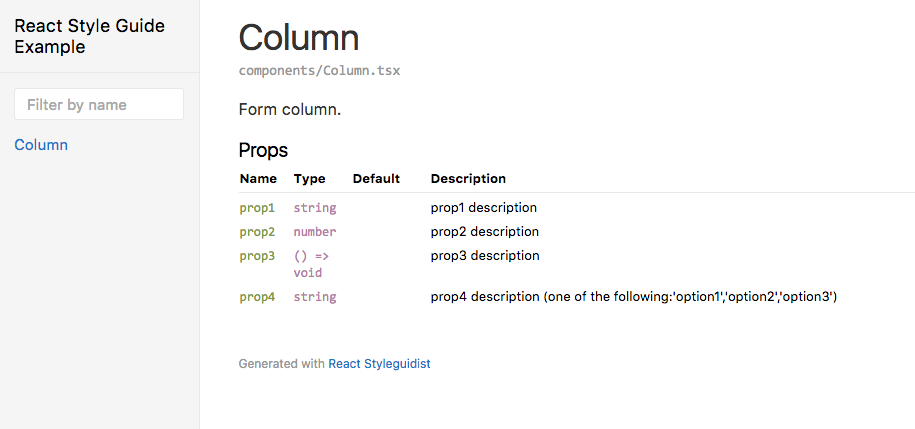

# react-docgen-typescript

[](https://travis-ci.org/styleguidist/react-docgen-typescript)


A simple parser for React properties defined in TypeScript instead of propTypes. 

It can be used with [React Styleguidist](https://github.com/styleguidist/react-styleguidist).

## Installation 

```
npm install --save-dev react-docgen-typescript
```

## React Styleguidist integration

Include following line in your `styleguide.config.js`:

```javascript
propsParser: require('react-docgen-typescript').withDefaultConfig([parserOptions]).parse
```

or if you want to use custom tsconfig file

```javascript
propsParser: require('react-docgen-typescript').withCustomConfig('./tsconfig.json', [parserOptions]).parse
```

### parserOptions
- `skipPropsWithName?: string[] | string;`
- `skipPropsWithoutDoc?: boolean;`

or

`(props: PropItem, component: Component) => boolean`

## Example

In the example folder you can see React Styleguidist integration.

The component [`Column.tsx`](./examples/react-styleguidist-example/components/Column.tsx)

```javascript
import * as React from 'react';
import { Component } from 'react';

/**
 * Column properties.
 */
export interface IColumnProps {
    /** prop1 description */
    prop1?: string;
    /** prop2 description */
    prop2: number;
    /** 
     * prop3 description 
     */
    prop3: () => void;
    /** prop4 description */
    prop4: 'option1' | 'option2' | 'option3';
}

/**
 * Form column.
 */
export class Column extends Component<IColumnProps, {}> {
    render() {
        return <div>Test</div>;
    }
}
```

Will generate the following stylesheet:



The functional component [`Grid.tsx`](./examples/react-styleguidist-example/components/Grid.tsx)

```javascript
import * as React from 'react';

/**
 * Grid properties.
 */
export interface IGridProps {
    /** prop1 description */
    prop1?: string;
    /** prop2 description */
    prop2: number;
    /**
     * prop3 description
     */
    prop3: () => void;
    /** Working grid description */
    prop4: 'option1' | 'option2' | 'option3';
}

/**
 * Form Grid.
 */
export const Grid = (props: IGridProps) => {
    const smaller = () => {return;};
    return <div>Grid</div>;
};
```

Will generate the following stylesheet:


## Contributions
The typescript is pretty complex and there are many different way how 
to define components and their props so it's realy hard to support all 
diferent use cases. That means only one thing, contributions are highly 
welcome. Just keep in mind that each PR should also include tests for 
the part it's fixing.

## Thanks to contributors

@RoystonS Royston Shufflebotham - complete parser rewrite that use typescript parser in much better way and overcome many issues of previous implementation

@JocD Jacques Dukes - complete support for functional components and much more

@sapegin Artem Sapegin - fix for compatibility with react-styleguidist v5

@diegolanda Diego - support for different kinds of components

@brettjurgens Brett Jurgens - adding support for default props

@dotcs Fabian Mueller - introduced parserOptions for skipping undocumented properties

## Thanks to others

The integration with React Styleguidist wouldn't be possible without [Vyacheslav Slinko](https://github.com/vslinko) pull request [#118](https://github.com/styleguidist/react-styleguidist/pull/118) at React Styleguidist.
